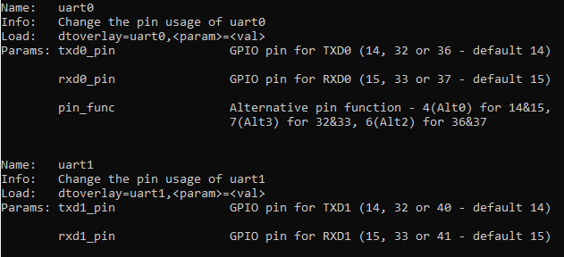
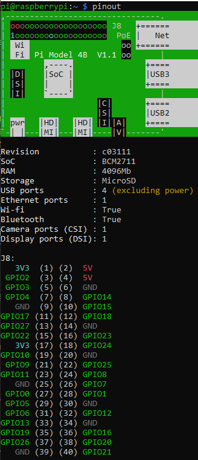

# Industrial Programming "Anzeige und Analyse von Sensordaten"

## Aufgabenstellung
Die detaillierte [Aufgabenstellung](TASK.md) beschreibt die notwendigen Schritte zur Realisierung.

## Recherche
Die Zusammenfassung und Übersicht der verwendeten Tools und Technologien kann im File [research.md](research.md) eingesehen werden.

## Implementierung

### Materialien

* SBC, Raspberry Pi 4 Model B, [Datenblatt](https://www.raspberrypi.org/documentation/hardware/raspberrypi/bcm2711/rpi_DATA_2711_1p0_preliminary.pdf)
* MCU, NodeMCU ESP8266, [Datenblatt](https://www.espressif.com/sites/default/files/documentation/0a-esp8266ex_datasheet_en.pdf)
* Analoger Temperatursensor, tmp36, [Datenblatt](https://www.analog.com/media/en/technical-documentation/data-sheets/TMP35_36_37.pdf)
* female to male jumper wires (eben weil der Raspi male pins auf diesem GPIO Header hat und wir von dort auf ein Steckbrett gehen wollen)

### Plan

#### Übertragung via Bus

Da es recht einfach ist und für dieses Beispiel vielleicht auch gar nicht so schlecht ist könnte UART gewählt werden. Hierzu braucht man nur 3 Leitungen RX, TX und GND.
Außerdem muss man auf dem Raspi die UART Schnittstellen aktivieren. Das geht via ``sudo raspi-config``.

``sudo raspi-config`` -> ``Interface Options`` -> ``Serial Port`` -> ``No`` -> ``Yes``

Dann wird rebooted und mittels ``ls -la /dev/`` die ``serial0 bzw. serial1`` geben.

Mit ``cat /boot/overlays/README``:

Hier sieht man welche Funktionen auf welchen Pins laufen:



Und dann sollte man noch schauen wo diese Ports auf dem GPIO Header sind. Glücklicherweise gibt es hierfür auch ein Programm welches ``pinout`` heißt.



Man sieht das die 3 Pins die wir benötigen also gleich nebeneinander liegen. Auf dem ESP8266 hab ich einfach D7 (RX), D8(TX) und GND verwendet. Dazu noch die SoftwareSerial Library die in der Arduino IDE per Default schon dabei ist.

Auf dem raspi kann man mittels python auf die Seriellen Schnittstellen zugreifen. siehe [inserter.py](src/raspi/inserter.py)

Hier muss eig. nur mehr eine Library zum connecten zu influxdb.

<!-- TODO: noch über die Implementierung via UART, SPI, I2C, CAN usw.. schreiben -->

#### Übertragung via WiFi

Da der ESP8266 eine WiFi Funktion hat ist es möglich auf dem raspi einen Webservice rennen zu lassen (z.b. mit [``node.js``](https://nodejs.org/docs/latest-v10.x/api/) und [``express``](https://expressjs.com/de/) oder ``django``).
Auf dem Webservice würde man dann z.b. auf POST bzw. PUT Requests hören und diese dann in die influxDB Datenbank INSERTen (das würde aus node.js mit [``influxdb-nodejs``](https://www.npmjs.com/package/influxdb-nodejs) oder [``influx``](https://www.npmjs.com/package/influx) gehen).

### docker influxdb & grafana

Docker Container für InfluxDB:

```shell script
sudo docker run --name influxdb -d -p 8086:8086 influxdb:2.0.4  # pull the image, and make a new docker container with this image
sudo docker start influxdb                                      # to start it if not already started via run
sudo docker ps -a                                               # to see if its running 
```

```shell script
sudo docker run -d -p 3000:3000 --name grafana grafana/grafana
sudo docker start grafana                                      # to start it if not already started via run
sudo docker ps -a                                               # to see if its running
```

![image](data:image/png;base64,iVBORw0KGgoAAAANSUhEUgAABFUAAABFCAYAAACL+tlDAAAAAXNSR0IArs4c6QAAAARnQU1BAACxjwv8YQUAAAAJcEhZcwAADsMAAA7DAcdvqGQAAClFSURBVHhe7Z1fbCNJft9/1Oze7F7g8zrBHpAjxLlgHEsDxE6CNYwjJASjefAdJL9twADSGELy4JMmdy8GCFgb62kCKQCRzcNdJNoBbEyiEWAiizwkmuQOiDgPImgc4LPzB7C0yWBvSNBAcEi8WAfZW+/uMfWr6uqubnZ3VbNJkRS/nwV3xC7Wn6761a9+9euq6sK9e/f63W6Xlh89pXqlSAE9auw8pKPLvvcdAAAAAAAAAAAAAGh8pwoAAAAAAAAAAAAAcGfB+xcAAAAAAAAAAAAAZABOFQAAAAAAAAAAAIAhyORUKRQK9OrvF+h18VkQf0cpLBXote8X6IvfJ3pd/Puq+D4N6HLf/sZ0lGdYbPV/HRQKb9FXHv4JfeXLk63LwsYhPX/6iJbHVA+jTn/j8Dk9fbTsfQMAAAAAAAAAcBNY+Ob+v/D+zAc7VG5/h+jzbxP9v18l+on495b4/sqEJv9gtChnyl/QL/3j5/TmG3fpzcpHtLzylhcKAAAAAAAAAADMHwsv/90/9/600+/36dN/2KePxeen4m8Nr6B45bdE+LtEn16p633x71++R/TKb8ivYAQk1f+4YYfKX996Tl/64D7918Z36JMPv0Pv/8sv0WXrj7xfAAAAAAAAAAAA88dC77Lrbyvh7TG3E7bvLHxTXZdh/zSy+uTrRK/0iD75T+GJfv+lmJAvqr85/mviY6bD301eEen6eYj8zVUuuow6nD96O49L+TU6jbjwUP6RLTa28qeF621RZn7mtdz171EoLNOjp89Hvy3mzbfpS2+8oI/+xw+J/tov0O0Pr+jjjE4dv2zPg8/hhlc/Xpj+zsRtv+EtNDpus1r2rioG0z+kjYx1kDd9WWY/PHm7T5DWU3q0HH9/0XvnV55zevyvLf0oQf1u0KFOP5L34P2F22MUhO5viPYBAAAAAAAAgGlj4eu/HWz/ufWbYqL8rtq+8wmvMvkt8QNv4vPT3+mrbT3vDU6ECndE+AVPzMJOgVsfEPWLQRoLb/fp9tdEGl8v0MffFtfeJt9xwE6DWyINzoM/n/5AhP1eELfwG8pxo8P5E3XipJWf4fCFP1DhPxG/e8XYnsQOlVfFvzrtT0Vetx/LIJ+08jOJ4e8TfS7Su3Xf+6GgIP4uiHvUK3uYYet/7Pz4PfroQ97y88f01bs/T5/8+X/3AtxZ2t2nSqdG9+/f9z97Z+H2S4Mn5FUK4q/V2l4Iy90y7Z7UaaW144fvNEpUPdl1di7lTZ8dKs1qiRo7a/5vto4uZZiJTkvVxRYdXao6iOZf61SofrAuwzTFSp3qKy3aWVujtZ0GUWU/5BixUa5WiWqqfCp6UP687WODnUGrF0Hd1NrlTO0DAAAAAAAAANPIQutf1bw/xcT/3YLvqOj/rpjIF8VE/xfk10TYkXLra+K3H4jfPhbf3yPpUIibjvV7Iv1/JH7LqxzeF9+96ww7DUwnyecX3h8mvxI4QeKwld8Mp++JcPFPQYTLexBpf/ZvVBDzufi7H8kvrfxMUjhv2/nsD0Q+op7YSeLXWeQeh6l/k37/ko62xKR164gujZUk+jyUv/0t8fm1be8q0c/92l84nYvS7/8R/dnJz9D7f0z0pa/epdt/93koHWfKq0OtTigUNmi13KPGk2felQhLD2il2KbT4yvvAtHV8Sm1iyv0YMm7kMIo0l9fLVOv8dh3ksRzN3Co7J151+Lzf/akQb1offUatPPwWLXt1UvqeJddadfWfEdJbP0M2T4uXB5thZw0zy4CpxUAAAAAAAAAzCoL//d//Zn3Zz7674vJYZHo8+fiy98Qf/eU0yIEX/Mm++xo+ORX+/5KDfPNQXKlC6/aMJBOl/eIvvC9fuoWmKFgx4r459XvqLRl+uJvvsZOF5+U8kvSwtmJo50k4nNL/POpuHYtLO/Rm6TOQenQd6VDhB0tr79B9Mn/+aH3Izsft/4OdX5E9NF//hZ99FWRzsMDet1xEs6Tarm6o9lU2z8ON7wQB5buUEmU/GXg0whzd5GKvS698L4qXlC3V6TFu97XNHKmz6tP7pSIOokJKIqVKlWKMc4bmX+RKnWvbsSnWa+IKyW6Yzo9Oi99Z1m/f0Z7xkqXvORqH0Fh+RE99cquPuHtPdHw6PYqAAAAAAAAAJhFkl+p7Dka2FliY6EY/Ov/vif+1s4VbyKYBK/c4K0u9F6w/ebjdwcn63oLzMdfL9BnIq9Ux0qG8utVJZ9+u+DnL/OJOk1ywE6Wz39AcgsQb/2hP7TUS5byW3jtr/48ffLBe/IclA/P7tOP3/iueovPh9+iD/7U/f6UI+YFffK//zX9iA+sfWOdfu5NL9ABnrjz1o+1tR1qlKqZJ+4mS+zF0LzoUq+4SGH/yV1aLPaoG/aEODNM+qWQB2SQXmOH1modqtRPwtt25KqTXmjrkPqMzmkyQIwjKU/79C+PaCtU9j068+Rbbnnar5C4QT/c3F4FAAAAAAAAALNKolPl1q+LydAPiD6zOESYn/a8PzxurYpJVlfE985acUE6ZF6qv9nJ8oXfVH/HIR0Uf+h9ScBWft6qtOCdaaIdHq+IOOOEtxTxOStf+Joo1++qa0lkqX8NT17lYaORQ055hYl+U4/eyvNfvis+/+GJvObO36Lbb/xP+vjHRK/9zXW6/eEz+nPxd1Z4m9J5KxAa/v6yw7tP1BkivKrhxFzJcHVOrV6ZNneV04LPL6lXPE8eEwln1g+qVO616Dx98YgiZ/r6foqVbev2mf7ZnjrPxHCs8KqTi3aRKtvhM1TGyfp2hYrtC9/xYRJtn/ywAypYycPbnQ6wUgUAAAAAAABwAyhUfnG5/x9/1KNXfo/o1WIwwer/oEAf/7b6LleSRMIZ/s1P9kmG0T8T33+d6Au/0qefvleg/ttEC2Jeps8Y4YNoby+KCb6XZpTCNwr+lh/eePPZu0S3/gHRX4r4fHWgfMb5JXHls5XfDGdsv7GV3xbO6Dz4wN0seceFM4P34B2CSsbZGyOg8OUDWqp8m2573yX8WuWn/8TpLUB+uQw/Reh8EIF0pMgtL0ybajtd2hSy9dj7TSic454uUn2z66chJ+rNKvlT9Uj6NkaRPh/GajpjeGWKPqyWD6Ld7Abf9W/1OSexddQOzl6Rv188DZ3F4ootbZf2yYs6yFfXXo8atRatbAbtCwAAAAAAAACzSMipwm/GMQ+LdYUdCl8Q//7kdyYzOdJOh2HLf10klXNmyn/v39Iv3f33Q6xwAZNEO00WT4ODagEAAAAAAAAA5Gfhv32Wvl3BhT4fTmu8XpidBK9+M3+6Nw35Wmjx77UdUAsAAAAAAAAAAICxkXxQbQb6V3365F3y357z+vf6tOCdjwJEJX9TvdXo9ttEn+pXLs8g/T/9+1ilAgAAAAAAAAAAeBTu3bvX73a73lcAAAAAAAAAAAAA4MJIVqoAAAAAAAAAAAAAzBtwqgAAAAAAAAAAAAAMAZwqAAAAAAAAAAAAAEMQOlOlsHFIzWpZ/s30Gju0dXQp/9avZa0U5VdBm2pr79BZv0+F5Ud0Uq9QsV2j+3tnMrRQ2KCD5iZ1dx7SMe2qcBli0qOGCD+6VAe3+un0GrTz8JgujQNdNw6fk1E0hZefLX9Of/nRU6oHhZfo+xu8N0FMGdJwKp93WWKUFVjqT7ZllUqGPKr2JGf5YdLkO00+wHwwtP6zyOfx1Xou+bXpt1j9Cv0CRkxS/3AZP130q1X+5TeTwH5ISz82PvrHTBEnY6ntK3GzL23xlX5dpFNP3zNR+zKtfGC2idVvxvjPpNsH6frRRX4hX2Ba8eU3wT616l+H+Z3Nfpim/uGvVOFCN6slcRNrdP/+ffl5TNv0aLkQFLgjKs0L22mUqHqyS8sF/erkHvVKm/L3UfqXR7Tlxau11c2qdLb8CmeWHqyIWqxRg1bowZJ30eNsLyZ+yChKzt+HG90rB3+iFa7TXVvbEWWoUP1g3QuxYy8fK1lVtzL9UpWeP31k1N98k1p/S3eo1OsRrTyQ9cXyyKLCl0zS5CdOvk8Xt2nDrH+LfICbSy79Z5PPEciv+LVFv0G/gPGR1j801vHTol+T5N/VfkhPH/1jVtH6d6Wl2z3cvnntS2f5SsBWPnAzaNcC3Vdrl6naPJD2o9U+8EjSjzb5g3yB6cc+/060bx3t46Txfdr6h3SqsKdou1IUZQ68Sszl0Z76vr5NlaIwSt555oUQXR0/loph27ebOnR62hH1MjAbcEJVZJE6L5/ReYvrN2s6+fI36fcvRRlEi5bujMXo4vSPHzeoV4ybPIF4WtTqePW19IAWW6fiSkCa/LCHdD+yKoA529vznzSA+WU0+i9dPvPIr8Jdv0G/gFFi7R8Rhhk/84//7qB/zBp3abEoNODLK+97dsYrX/nLB2aLZ0+E/qAS3WExcrIPArLrR8gXmHbS7VO7/rXZz2lMV/9QK1XYU0Rtugh0QoilOyWi9kVoAsqK4WWH9YJROc8uqFOJPP13RVTkilBMXIYrkXDR81plIk/+BtqI7LXO/SVKI+fqnFq94liNx5vG+YXqtEsPFql7/kJcKdLiXRWWJj/sIS32WnSOMQnEMSL9lyqfgmHl1yeLfoN+AaPC0j+iDDV+jmL8zwL6x8zQ75/RRZuoXG3S4caQMjFG+RpJ+cDM4jw/8siqHyFfYCZIs08d9K/Nfk5i2vqHcqrcXYzZzxdwl91ATjyjJ40Sbe5mN1TkxFcrJtE47aGeIlnyL1fp+fPn/ifaAMVKXV5vNqtEtTUsr5sWtHxyp13Zpu3F7oCDxFV+eEA79GXgaXi5mkU+wA0lr/6zyefI5Hd4/QrA0Fj6h8Y6fqbo15GM/9DfNxbeHrxWa0vDWbbv4YYX4sZo7Mtk8pYPzBbr23w2hHpQ5zo/yjO/gHyB6SfZPk3Vvw72sSRlfJ+m/uH09p8X3ejmpmSujk9FxTygLOOVXhrU9h6FKc/TcE+RUvOP7MnaOxMNbKD3MvK+xvJqzLo9MDk6L+mS5aJTplL3nMw+l0V+OGxPtPHaWo1EM4exyAeYT5z0X4p8SkYkv8PoVwCuA+v4maBfRzb+Q3/faPpne7Jd5djNBrbjmTijtC/TGLZ8YDbwJ2ziUyWha7aO5EoT1/lR3vkF5AtMO3H2qZP+tdnPjGV8n5b+oZwq7DmiMiX1c16uE93/x0/8V8uD+5hkhXXi9xImIpcGRZSWSHuYJZpD5R9B7pcUjTLWJ13ynnvUinXJgSTYI8kefr28UmKRn6vzFvbPg2RGqP9i5dNgGPk1cdZv0C9gVFj6R5TM4+cIx39n0D9mFtaB7+xkOBPnmuUrc/nATGAeVGu+hCKLfcDknV9AvsC0EmufZtC/NvvZhUn3D+lUkRUh9ySdhLZDLD86VN/lcp0K7RvLetYPqlTuNeiJcj6FYKVRWl31vjnAy3/4NUve6fzS25SjUjLnH4FP4z7l+tgMn949KljhHshXUJ3GHvQHwsg9qwnIPasW+VHtWaRKXZ3WDoBJXv1nk8+88hvFpt+gX8AosfaPCJnHzxGP/zbQP2YfuZzc9Zy0vPJ19ZI6VA4ta1/a3RT6Pzn/TOUDs03G+dEo5heQLzCtDNinFv1rtY+HYJL9w9/+wx4icZ9i4hl4k/bpiTQ6pOdnrUYdb0+g9DSVRCUZ75oOwYfAlcpiGHJjfbU8eGhT5CC5jUPDw6XLkbRvKil/XhLklZ8/Tx8tewGDSG+yUJSuK17s5eNXsKm61Xsqw69cnm8ytW8EF/lh+VavwQvaoCxMpdCDhAzyAW4WI9V/GXGR3xCx+g36BYyPtP4RR+z4maBfM8t/Eqn6G/1jVuG39z012pU/9ZWWs/7NK19x+t/MP2/5wGwzjH2QZX4B+QIzRcQ+Hff4Pm39o3Dv3r1+t9v1vgIAAAAAAAAAAAAAF5wOqgUAAAAAAAAAAAAAYeBUAQAAAAAAAAAAABgCOFUAAAAAAAAAAAAAhgBOFQAAAAAAAAAAAIAhgFMFAAAAAAAAAAAAYAimzqkSfT0SXmsLRsm0yBe/QnoSeaN/xaPr5XCjQIWNQ1E3T+nRcsELHWRS7TcMhcIyPXqq7i2JrPcPQB6kjD19RMsFyBgA0wb6JwDjY5bsx2liFuYvvlOlUNigQ6OwcUa1Ns6fPz+kjRhly4Lix49RyEF89YlWCJfhoF6hTm2N7t+/Lz9bR5deqEv89PBxk1Y/y4+e+uWaVPnmHZt8XResGDbLbTo9vvKuXA/Tcv+zzqTaD4BJ4WIfADAOlCEdtqmUPI5OBqPyHWebQv7nG9v8xsYsxw/FFZ+4uYst/bzheZim8ifZjxwfc8JkZmX+Ip0q7AzYPalSqbHjF3anQVTZ3/UFgz3XzeY+Uastv0dhgaiWGrSztkZrazvUoArVD9a9UCVIJ806LZ6mVMjSHSpRmy6eed8NbPGd0h8jtvphekb9Xnf5gCBFvq6TpQcrRI0ndNbve1euiSm5/+mlR90X4p8XXfFXMhNrv7Hjdv9gvnCxDwCYZdYPqkSesb6mhNt3mkD+gW1+Y2PW45/tBfOWtbUadSr10MpXW/p5w23YVlZNU/lvrv04ZmZk/uKtVLlLi0WizsvAc3Z13qJecVGEeIPKJo85D+n4pQo3YQ/SarlHjcfHdCkEpd+/pOPHDeqVN/2BaX27IgRph/bOhhMkW3yX9Fnw0zyJsmPqcPGJeg2T4tvqB9jhOjRXGemPVny80ofbw1zxk9o+Caup0kiKr8t2uGE+rRp8UuWSP/cVFtXWedhLPS/3P630L49o6/4WHV0K/WX8HSWp/dLaJ6i/oD5MI8C1ftOIkx8zP8WS8Ztw+q73D+aRdPvAFVM/NKtl72pAov6RKxXC8hq95ib/6aTpr7j0+aPzGAyfLf03y4xCf/Kky7cdr86p1SvSyoMl9X0E8u8inyH5y2ifpsmfa/2k9U+X8t9UXOY3acxKfL+NU5wTTL9/RhdtotId1T9s6ecNd6F/tke1ToXqzQOr3p1k+fm3UftR24zc5YqVetDHDje8XyiS+r9r/x4ncfqBP1pHzNP8RTpVWMieNHpUrp74QsLLbLQ3jYXkaGsv2bO2vkpl6pAec+SqERG/KP5bFKOOFroWbRuFDm5KV3RTxilTtdn0fqNuzBbfFs5whVWp5nsrZQc0PIkssM1qiRo78Std0uJb6wdYWT+oU6Wj6ld6entqZY/pJGOFU19pKW9w5GkSy9DqRdB2tbaQoxP1JMkmX7b4mnJ1k7qefMjstwP5cYnPLO1uUrl9OjBhnZf7n3WS2o9Jax8X0urXxtLuvi8/+hN1MJerwUq+rOmD+cVmH7gQHT/XauEVnan6Y2CSK+T9wQoVjX7oIv9p2PRXmn5mo233pE4rLXMlQ+lG6r9pplwNVpso9Tts/YedKKOQf5t85rFPXeUvbXyx9c+8/WumscxvrMx6/AgcP7R9xZZ+3nBH2DEq5b6p+mkSkyx/nP14ebQl+xN3udBuhr0z7xciTcv8lBmd/ssO5i8B/pkq3LBrtQ5V6k1qNlXjZNqe0uvSi6VdeYhMs75CrR1VsQFFqixe+IVWeSmvohYqrugetUXW+uZMR0VyfFu4dro0ngTrhp49YU/iqh9/fbUshOBx7GTJJb4LIS+kxRs8T7BRcKdE1PbWdbGT6rzVo2JUI/UatPNQeYPp6qVQYwEsQ2YHfsauaA8X+UqLr2nXHvrycfVS5F6647ehS3y+zwcrRf8+NfNy/7NOUvv5pLSPC2n164RFH7WFTtdtNFT6YG7h/j2sfRA3fkZJ0x/yyd9pm4orD6S8JvbDjOOxSVr+Vv289IBWiuE98lfHp9QurpDhBwJjJqTfctQ/bwUqC11uimse+fdJkM+89qmr/CWNLy79U5Kjf8081vmNhRmIrx4OC7tw60jZMBHY8aYnt0JYwg5FW/p5wx0x+2nSSrBJld9qP6aQ2v89RqX/soL5SxjfqcICp8YK3hNWI6o2B5YfpVKsUF0KE9/wFkXO4BFElPazC1E9JfJWYDlgi58SLvdiFWVH004N5fVS4VoozOWdISzxXdCCoT/ySQSeZEm4E7KMl1eV51Arn5484MGg89JX9vz0aM/YosDeYVZofvvELC9P41rir29ThcLGGjM39z/rJLSfT0r7jBvWL+opjaejsuhuACzksg/k+Bk8yYvDqj94PNdGIk8iI/0wr/yn5W/Vz3cXqchGtfrm8YK6vWxPWsHk4SeWVXYweEv5NXnt41T5zGuf5pU/h/459+OLdX5jYdbjC8xzSU4X62EZsKWfMzyqn1O3Z3hnwpU3w/OrSZZfYrMfE7D2/wmD+UsYdVCtSHCTB5Kdd6Tnh2/4HfYKue5p84TY9AQp77l38KEkr4Fhi58SLr1ifH8s8EHHYuE3Jz16j90AjvGzID1hGfek33jKVSXQTbWUzP1J6DLt7rP3OVg6F12+msZ1xZfe5tZ5yFgLccPvf9axtt+E0Y5bufyyJGRp3gxfMBZy2wcxLLGV6OGiPzjPi7baAiQP+ovph8PKv7P+StLPbP8MjOW8hcS0f8C14uAoiMIOFfkQe8ewYwWjkv9E+cxrn45B/sz+qZnb8cVpfpPCrMePQc5f9JN+W/p5wwXqnDezb8Qft8B9WK0UEX0pYcUNc93lZ/Laj4n9P44h9F9uMH+RqJUqUqmH9yxL77djo7DAn4oymJ5BPjhW73lWBlE4XO4t67Uoct5jLLb4buHFxDME/OVKle1Y76ctflZkI26WRS+8iFUM84Zafmou6xIfYz+hnfAeaE7vIJOncfzxlWE2+Bo1Zh7uf9ZJaz8bA558kdbJEPXD9aoO2kp5SiPQ+gyAkZDTPlBnopRpc1fF5/3h9YpQGD5u+oO3RPA+7P2VTmo/zC7/6fnz91T9HLk/Rm0hcbNvgAUpf+H6tdmPyv50t6+UTA46VCR55T9CVD7z2qe55c/aP8PM2/him99oksbn2YnvdlCtP3/xVh5Y5385w13h1WT1Skfo6Zg+bDCJ8rvYjy+6oo97W1xNrP0/BpX/9cwvreOjlZs1fyncu3ev3+12laEvlxxq2HMeCCcL7GA+XJHKey8F9aROvi5u18IH7UTDzf1VHqoMi3TqpWlii585nImUUT2pCH7AB+1ob5stflr9PKOlgbhm2mCw7iVG/crwxdPEzqoOctINIGS31qKVTaLHpgykyVdK/Cuv/fiQT73vTv5+s+vLmC1/W/lv+v3POk7tl9Y+If0q9MJOlzb33etXXmNl3xTGsqF31fUY3WToPx1uSx+AJGz2gY1QfJbN00WqZ9QfvpzzgXhGP7PJvwu2/G36OeibHhnzB+mk1a/NNrMxkLaPYd/mkH8X+XS5h6gMhu1Te/2kjt8p/VOPT2nlv+kMtE+MfCWNz8xsxPd+Q3bZjM5fbOnnDbeRZs9MQ/lt9iHjlIZxE/oe4u4va/3lxTY+2u7fafyXOmr65y++UwWASaE6Cy/ZC4wUPUCI0cHvCLOKuhc+eTreCLvp9z/r2NoPADB+tPFoGkfXAfTzdDMpuQAAABvjth8nrf8wPobxD6oFYGLIpbQR5J7A8J7EWYWX96YeWnrD73/WsbYfAGDsyNe6DnHQX26gnwEAAAzBjbcfMT6GwEoVMBUMLh9zX157E5j3+wcAgDgC3Ti4rP26gH6eXrBSBQAwr0yD/sP4GACnCgAAAAAAAAAAAMAQYPsPAAAAAAAAAAAAwBDAqQIAAAAAAAAAAAAwBHCqgKmB9wa6vCc/DT6J+ql8V7/6PH20LK/znj997fnhhrw2TvgVXfo+9H0dbgx3T2D8aLnhNpJt9/wpPVpObi9+hbqWrXlhFP1zHIyqf02z/skqn9OOqR8BANMF+icA4+Mm2o+YvylCThW/Up4f0kZMpQTh4Rt2IVQpCfHz5M9CmpR2tKH8j9H4afEZfkXUoREeNWpt4WD8yNd41SvUqa3R/fv35Ue/i/7yaEt+32n05PdZxNY/0oB8jg7WJ5vlNp0eX3lXRsNNd9Tc9Pu7yfonOvZeh2EDAKPst/CYp8az0Y1hNvtP49uScDjMHSEZGaL9Zzm+i/2Ylr5L/DzzSxvTVP4k+5Hzv8n2kQ2u45tgP/lOFfbMNJv7RK22dyUMC8JJU50wHL1hV3qNHT9uNH7e/M/2gnTX1mrUqdR9z1L/8oi2vDD9qXE2nZd06b1JIC0+d5bdkyqVjPLvNIgq+7uy49nCgRv9/iUdbYn62zry2yUT8jVebbq47lduXgO2/pEG5NMV7xVwL7rir2SWHqwQNZ5M5C0kkyR3/5xypl//uMnnqFH6o04rLaU/1tZ2qFGqzrUBCG4WafafRvaDfWH0t7OPwWC24QlvtdSgnbU1pf+oQvWDdS/UzizHd7Ef09J3iZ93fpm2smrayn9T7UfM3xTSqSKFZpOotvaQjl/K6wOsb1eEIOykvrKJBdP35GXwhI4qfw2/F/xCjHulO0velTDsEVst94Rcx7feYPy7tFhkH0zgWbw6b1GvuChCGFu4IlQ/Q6w2uMmkLe9i+WAP8OGG6S0e3VOqIP0gvdDyL6Ew+emUOYlQbRluQ7N9m9Wyd9VkyfBkp3i6B7zk9v6Rjpt8zjPK8bolXwFn/h2FdQerotb54CqVJP1nk18t+ywyRWHM+2kY/YB/w/Jn9hMtj0o+w/JkXnPpP77s+eFh2c7TP13uz8Zg+cL9VZHev9LIc3/Xgat8joWlB7RSDJ6ssfF0fNqm4soD5zGesenHpPHRJt/yu5N8pJOUPxOXPn/MBy/hcIzv18Wo+2eS/bi0uy+mWg16cuFdyICLfCaNHxppkxjxTXskTf5c6yetf7qU/6bizxceH8vJotR/jxvUK286ydisxPfbeED20u1He/p2+zPL/C6O/tke1ToVqjcPYvTu9JSf84raj672UVL/d+3f42SS9lOQfpDeJOZvGulUYSE62tpL9JxpoWvRtp9pNFEuUJVqvpdOCrijJ3QU+ZtwJaYtz18SM9Ry+zTRKI3G50H2SaNH5eqJzJPLw8uUtLfRFs6w0K1eBF7MWrtM1ROsFNC4LO8qVzepu6PqUHqKt5V86Q7dFHVeJFGvzaYnI6MxbHkS81C5plX7SvkQSnjnHb99o/K/JpdChSlXA0/2Wq1DlXrcADCIrX/YcJFP4EaS7nDRf0nyq2WfRSa0mm/vTIZreMCtr7TU0xRDHsUIT61ekVYeBJMAfhpSjJSzXK2yZy7I33vSwoOSuRJBhZdC+ilP/3S9vzTkhKYT1C9/ogaM2b/M/F2YZv0zce4uivuKwKtlMjhlbfoxdXx0kG8X+UjDNj6vH9T99OWTTCEmLMuch0v/AeMnSb9lJc5+5Gv7PGSKiVe8VZmOTT5t4wdPEprVkrA5AhnVT8Jd5S9JfzG2/pm3f80066tCq3dIz6lZFk6kri/SoosCnPH4VvvRkr4tPn/PMr9LglebSblvqnw001T+OPvRxT5K6/+aUem/YZhm++m6528ZDqotUmXxwsg0SFQLlbny49kT9vSthjINeeFiPPHpJOev4YrRjeN3mAhcVulUjFmlkhafhUbl2aRmUwmvKdQu4eYg9IwfhYBMtGsPfWV09bLDj5KkDOkOzRPNHrVF1WvFM7wjIgp3zMeyXx7QgbKu/LLEyX8cbSETvgw8uxAlLZH5MEw5T0S5x7C9wiafwA4brw9WitSOrE901X9J8utMr0E7D9XTFJGAMAMU8smKsXIgqZym/F0dn1K7uEJynhpZicCEwh3JfX82IvUZJXR/Y8h/kvpnokhdVaZVbw4mJ3FCBw44WhJw0Y9p46OrfNvkI420/Dm/OyXR/l5+XJ7zVo+KekYyov4D8pGo3xxJs//Uk+hgzB+KBPl0GT/WV8tC/Sfk7yh/SfrL1X7J079mnl6XXiztyifezfoKtXaUY9WZGYifZn9a7UdL+nb70z6/c8HMx1y5MA3lTxy3HEjt/x559d+4uenzN00Gp0okUzNRuRdKCJUQOO00UV6nIFNdcfojPfGZnuSk5O9h7os9XazHLi+XnsJei2JW76fG5wFX9SXec1cjqop7zRDO3jHusH79xC4vAtPM1fFjaojJRVn8/7FhwCj5Dzzd04hNPoED69tq+XdU9zrov5FgnAHFT0/2zC0grA/1IMpGdlw5k+CVCGxUeF8VL6jbc3wSdg3w+KGeQnl1DNm9NljW3hEGT4l1Bss2n+10ygaQIw760To+WuQ7r3yk5c+TDbYBy55XSRvHPXnAjWAG+g+wk2T/8VNiPm8hNOZnJFU+LeOHduqZ2w9C5JU/h/459/q3KOYrcrLNE74tyiwKMx7faj9a0rfbn+nzu6h+Tl3F4J05Vt4M5peTLr8kyX60YO3/wInrmr9lWqmSqKDlU1MhVFIgg4GJhTPJsyafBGVYPpyafwwy/ciTSvZIbVeK1D71nvamYMaPLhfSRqbec2cNF52Cn+yJH/h1E7e8CEw3egmsy9a2JdaCU4JNPoEb8mlB63xQdwyh/0YNt+lFW22RkAehxZXTxBxIYrdy8D5i72DUKUE75uX2i1J1/gz7CaLOcQnk+pjERK59MfSTJFM/uoyPLvI9rHw4j89lkSZPeJtqK5D/pHJG+s9ckdNQNu0/1vty0uU5FKTDzfue5VyRRPl0HD+Szggch/zF2S9zq3+9Sbr5pF2tDnKs3xmPb7UfLem72Z/p87vw+MOf+FUMvJVErTQRfclbcTMN5WcS7UdHEvt/HCN2FNwErmv+5uRUUQZN2PNnrvhQ4UXnPezSiNkUA5OjUWbLP4qfvvFkl1Fx7J7Cgfhy0Avv6Vb7zD2htYXLAS7wNLJz5wArVaaGgSeRQomeRNqHn1bVKx2qvfOMnr1To7YwsH2DSu75L9Pmrmp/9dv0xfHrB9WBvZUsd/EHhbnBcqUOgop48a3yCWyogTW8xFqTVf8l8aLby3z4pwkvGed9o/srndhymvBydn9SHJFfRspngn4dFtv9JcpvBL394qbA+kLfMz8RU/1f1YV5uNq0oPZ3k9SFTlj1o9v46Crf2eUjPX/+vir6Pj+l9I168zyga+o/c4scv8L1m2b/MSH9lpGo/WeuYOGPdLjxVkwhD+aWMVei8mkbP/Tvi5XteL2YV/4y2i83Tf/a4An9aWT+oeQrar/Fj1+zEz/B/rTYj9b0bfEzzu+S4LFT2uhrhnOEmYLyp9mPmiT7yNr/Y1DlH/6hxyzB9TMN8zdN4d69e/1utysFctCOYUNCeefkQHNSJz8vc3+/YCCcadek8REXxgfymHvS8uTvkr6s6Lp6B3Z0IMwSP/gJey6DzmsNl4aovkERVmvRyibRY6MO55VY2WEi8sOHBOm2k/W52Q3LoGyDRTr1ZEZjS58Jt5+Qu50ube6r9rlaP5BtZ+6p0+2pr4Xis2yeLlLdK98VLQ3mb+St8ctJ4b7F2PoHIycDYrYjShW6ztjkE6TDT0Dqi6cDbaaJlbGs8htNw5ARW/6MH58PFDR+l1Y2TSA7Hhb9Khnh/TFJ8hubf0z5bPknMbL7G1L/KF3CS4vfIVEB8sA09ad6jWN47/ZkCOmfyNjvQpp+lG0o6yB9fPTr0UW+M5bRlr/sf9EGNOQ3rf+A/GTWTxHdkkZc/Kj9Z5JFtzAu8ulyD1EZNMvoUj9p+iuz/TJn8j3QPjHylTR+MbMR3/tNjP1psx9t6WeOn1G+bH1y0uXPZL8llCGp/w/EY2Lad1zE5s94ZdDh47KfmHD7CPmfwPxN4ztVAAAADKKMFT65fLqdUHGDF5N0HYBZYlJyrAwuXlJuGtFqAiNmL+hTEwb6DQAwrYzbfoT+my4W/sqbX/T+BAAAEIWXd4YOhZ1S5J7RIQ5CA2AWmJh8y6XeEeSedcczDQAAAMwls2I/gtGQ4aBaAAAA0wYvC+UDFOWe0YTlrwDMKpOW7/7ZHu3wcS6ht7OEV64AAAAAYL4p/PLfe6t/+cMMpwEBAAAAAAAAAAAAAKxUAQAAAAAAAAAAABiGhV9+6xe9PwEAAAAAAAAAAACAKws/87M/6/1pp1Ao0Ku/X6DXxWch5n3ZhaUCvfb9An3x+0Svi39fFd+nAV3u29+YjvIMi63+r4NC4S36ysM/oa98ebbrEgAAAAAAAAAAyAfR/weopL+2Ici34QAAAABJRU5ErkJggg==)

## Quellen

[1]     "raspberry pi 4 model b datasheet";[link](https://www.raspberrypi.org/documentation/hardware/raspberrypi/bcm2711/rpi_DATA_2711_1p0_preliminary.pdf) ;12.04.2021

[2]     "Espressif ESP8266 datasheet";[link](https://www.espressif.com/sites/default/files/documentation/0a-esp8266ex_datasheet_en.pdf) ;12.04.2021

[3]     "tmp36 datasheet";[link](https://www.analog.com/media/en/technical-documentation/data-sheets/TMP35_36_37.pdf) ; 12.04.2021

[4]     "node.js v10.24 doc";[link](https://nodejs.org/docs/latest-v10.x/api/) ;12.04.2021

[5]     "nodejs express";[link](https://expressjs.com/de/) ;12.04.2021

[6]     "npm influxdb-nodejs";[link](https://www.npmjs.com/package/influxdb-nodejs) ;12.04.2021

[7]     "npm influx";[link](https://www.npmjs.com/package/influx) ;12.04.2021
